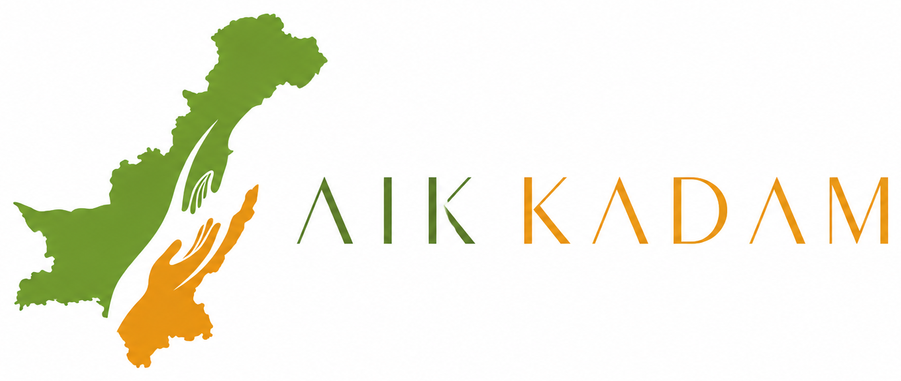

<h1 align="center">
  Aik Kadam Welfare Foundation
</h1>

  

  <b>Taking one step at a time towards a better tomorrow.</b>

  <a href="#about">About</a> •
  <a href="#mission--vision">Mission</a> •
  <a href="#features">Features</a> •
  <a href="#tech-stack">Tech Stack</a> •
  <a href="#getting-started">Getting Started</a> •
  <a href="#contributing">Contributing</a> •
  <a href="#contact">Contact</a>

---

## About

**Aik Kadam Welfare Foundation** (اک قدم ویلفیئر فاؤنڈیشن) is a non-profit organization dedicated to serving humanity through education, healthcare, food security, and community development programs. This repository contains the source code for the foundation's official website/platform, built to showcase our work, manage donations, and connect volunteers with people in need.

> "Aik Kadam" means "One Step" — reflecting our belief that every small step towards helping others creates a ripple of positive change.

## Mission & Vision

- **Mission:** To provide sustainable support to underprivileged communities through education, healthcare, and basic necessities, fostering self-reliance and dignity.
- **Vision:** A society where no one is left behind — where every individual has access to basic human rights and opportunities to thrive.

## Our Focus Areas

- 🎓 **Education** — Scholarships, school supplies, and literacy programs
- 🏥 **Healthcare** — Free medical camps and health awareness drives
- 🍞 **Food Security** — Ration distribution and community kitchens
- 🏠 **Shelter & Rehabilitation** — Support for displaced and homeless families
- 💧 **Clean Water Initiatives** — Water filtration and access projects
- 🤝 **Volunteer Network** — Connecting willing hands with those in need

## Features

- 📄 Informational website about the foundation, causes, and impact
- 💳 Secure online donation portal
- 📊 Transparency dashboard (fund utilization reports)
- 🙋 Volunteer registration and management
- 📰 Blog/news section for updates and success stories
- 📱 Fully responsive design for mobile and desktop

## Tech Stack

> Update this section based on your actual stack.

- **Frontend:** HTML, CSS, JavaScript / React
- **Backend:** Node.js / PHP / Django (choose one)
- **Database:** MySQL / MongoDB
- **Hosting:** (e.g., Vercel, Netlify, or shared hosting)
- **Payment Gateway:** (e.g., Stripe, JazzCash, EasyPaisa)

## Getting Started

### Prerequisites

Make sure you have the following installed:

- Node.js (v16 or higher)
- Git
- A package manager (npm or yarn)

### Installation

1. Clone the repository

   git clone https://github.com/subhankhalid31/Aik-Kadam-Welfare-Foundation.git

2. Navigate to the project directory

   cd Aik-Kadam-Welfare-Foundation

3. Install dependencies

   npm install

4. Set up environment variables

   cp .env.example .env

   Fill in the required values (database credentials, API keys, etc.)

5. Run the development server

   npm run dev

6. Open your browser and visit http://localhost:3000

## Project Structure

Aik-Kadam-Welfare-Foundation/
├── assets/
│   └── logo.png         # Foundation logo
├── public/              # Static assets (images, icons, etc.)
├── src/
│   ├── components/      # Reusable UI components
│   ├── pages/           # Website pages
│   ├── styles/          # CSS/SCSS files
│   └── utils/           # Helper functions
├── server/              # Backend API (if applicable)
├── .env.example         # Sample environment variables
├── .gitignore
└── README.md

## Contributing

We welcome contributions from developers, designers, and volunteers who want to support our cause through technology!

1. Fork the repository
2. Create a new branch (git checkout -b feature/your-feature-name)
3. Commit your changes (git commit -m 'Add some feature')
4. Push to the branch (git push origin feature/your-feature-name)
5. Open a Pull Request

Please make sure to follow our Code of Conduct and check open issues before starting work.

## How You Can Help

- 💻 Contribute code or fix bugs
- 🎨 Help with UI/UX design
- 📝 Improve documentation
- 🌍 Spread the word about our cause
- 💰 Donate to support our programs

## License

This project is licensed under the MIT License — feel free to use, modify, and distribute with attribution.

## Contact

**Aik Kadam Welfare Foundation**

- 🌐 Website: www.aikkadamwelfare.org
- 📧 Email: info@aikkadam.org
- 📞 Phone: +92-309-6888160
- 📍 Address: [Lahore, Pakistan]
- 📸 Instagram | 📘 Facebook | 🐦 Twitter
- 💻 GitHub: @subhankhalid31

---

Made with ❤️ for a better tomorrow.

